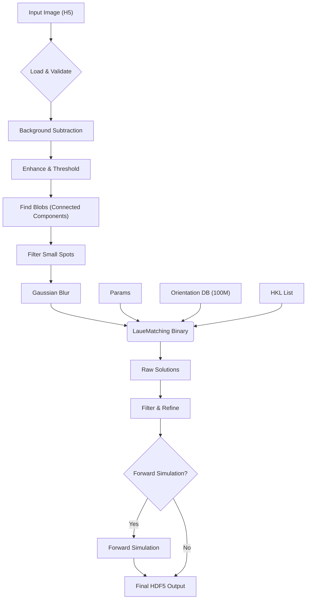

<p align="center">
  
</p>

# LaueMatching

[](LICENSE)

**LaueMatching** is a high-performance tool for indexing crystal orientations from polychromatic (Laue) X-ray diffraction images. It matches experimentally observed diffraction spot patterns against a pre-computed database of 100 million candidate orientations to rapidly determine the crystallographic orientation of each illuminated grain.

Developed at the [Advanced Photon Source](https://www.aps.anl.gov/) at Argonne National Laboratory.

**Contact:** [Hemant Sharma](mailto:hsharma@anl.gov?subject=[LaueMatching]%20From%20Github) (hsharma@anl.gov)

---

## Key Features

- **Fast Orientation Indexing** — matches Laue patterns against 100 million pre-computed orientations
- **CPU & GPU** — parallel implementations via OpenMP (CPU) and CUDA (GPU)
- **Crystal Symmetry** — supports all crystal systems (cubic through triclinic, including trigonal)
- **Lattice Parameter Refinement** — optional c/a ratio fitting via NLopt optimization
- **End-to-End Pipeline** — Python wrappers for image preprocessing, indexing, and forward simulation validation

---

## How It Works



The `RunImage.py` script orchestrates a multi-stage workflow:

1. **Load Image** — reads HDF5 detector frames
2. **Background Subtraction** — computes or loads a median background
3. **Preprocessing** — denoising (non-local means), contrast enhancement (CLAHE), edge sharpening (unsharp mask), and thresholding (adaptive/Otsu/percentile/fixed)
4. **Spot Finding** — identifies connected components and filters by area
5. **Blurring** — Gaussian blur to connect fragmented spots for robust matching
6. **Indexing** — calls the compiled `LaueMatchingCPU` or `LaueMatchingGPU` binary
7. **Post-Processing** — filters by unique spot count, refines orientations
8. **Forward Simulation** — (optional) validates solutions against the original image
9. **Output** — aggregates results, logs, and simulations into a comprehensive HDF5 file

---

## Project Structure

```
LaueMatching/
├── src/                       # C / CUDA source code
│   ├── LaueMatchingCPU.c      # CPU implementation (OpenMP)
│   ├── LaueMatchingGPU.cu     # GPU implementation (CUDA)
│   └── LaueMatchingHeaders.h  # Shared definitions and utilities
├── bin/                       # Compiled binaries (created by build)
├── logos/                     # Project logo
├── LIBS/NLOPT/                # NLopt dependency (auto-downloaded)
├── simulation/                # Example data and parameter files
├── GenerateHKLs.py            # Generate valid HKL list for a crystal
├── GenerateSimulation.py      # Create synthetic Laue patterns
├── ImageCleanup.py            # Pre-process raw detector images
├── RunImage.py                # End-to-end indexing pipeline
├── CMakeLists.txt             # CMake build system
├── build.sh                   # Convenience build script
├── requirements.txt           # Python dependencies
└── 100MilOrients.bin          # Pre-computed candidate orientations (~6.7 GB)
```

---

## Prerequisites

| Requirement | Details |
|-------------|---------|
| **C compiler** | C99 support (GCC recommended) |
| **CMake** | ≥ 3.18 |
| **OpenMP** | Bundled with GCC; on macOS use `brew install gcc` |
| **CUDA toolkit** | Optional, only for GPU build |
| **Python 3** | With packages in `requirements.txt` |

---

## Installation

### Quick Start (CPU Only)

```bash
git clone https://github.com/AdvancedPhotonSource/LaueMatching.git
cd LaueMatching
./build.sh
```

> **Note:** The first build automatically downloads (~6.7 GB) and reassembles the orientation database (`100MilOrients.bin`).

### Python Dependencies

```bash
pip install -r requirements.txt
```

### GPU Build (Requires CUDA)

```bash
./build.sh gpu
```

Or manually:

```bash
mkdir -p build && cd build
cmake .. -DUSE_CUDA=ON -DCMAKE_BUILD_TYPE=Release
make -j$(nproc)
```

Default CUDA architectures: sm_70, sm_80, sm_86, sm_90.

#### Custom CUDA Architectures

```bash
CMAKE_CUDA_ARCHITECTURES="75;80" ./build.sh gpu
```

#### Custom NVCC Path

```bash
CMAKE_CUDA_COMPILER=/path/to/nvcc ./build.sh gpu
```

### Build Options

| Option | Default | Description |
|--------|---------|-------------|
| `USE_CUDA` | `OFF` | Build the GPU executable |
| `BUILD_OMP` | `ON` | Enable OpenMP parallelism |

### Clean Build

```bash
./build.sh clean
```

### Using CMake Directly

Ensure `100MilOrients.bin` is present (run `./build.sh` once to download it):

```bash
mkdir -p build && cd build
cmake .. -DUSE_CUDA=OFF -DCMAKE_BUILD_TYPE=Release
make -j$(nproc)
```

NLOPT is automatically downloaded and built into `LIBS/NLOPT/` if not already present.

---

## Usage

LaueMatching is designed to be run via its Python wrapper scripts.

### Quick Example

```bash
cd simulation
cat README.md    # Full instructions for generating data and running the pipeline
```

### Running the Pipeline

```bash
./RunImage.py process \
    -c params_sim.txt \
    -i simulated_1.h5 \
    -n <nCPUs>
```

### Key Parameter File Settings

| Parameter | Description |
|-----------|-------------|
| `LatticeParameter` | a, b, c (nm), α, β, γ (°) |
| `SpaceGroup` | Space group number (1–230) |
| `Elo`, `Ehi` | Energy range (keV) for spot simulation |
| `MaxNrLaueSpots` | Max spots per orientation |
| `MinNrSpots` | Minimum matching spots to qualify a grain |
| `MinIntensity` | Minimum total intensity threshold |
| `MaxAngle` | Misorientation tolerance (°) for merging candidates |

See `simulation/params_sim.txt` for a complete example.

---

## Performance Tips

- **Linux** is the primary platform. macOS CPU builds work with `brew install gcc`.
- Place `OrientationFile` and `ForwardFile` in `/dev/shm` (tmpfs) for dramatically faster memory-mapped I/O.
- Ensure ≥ 8 GB RAM for the full 100-million orientation file.
- Use the GPU build for large-scale datasets — it provides significant speedup over CPU.

---

## Citation

If you use LaueMatching in your research, please cite:

```bibtex
@article{LaueMatching,
  author  = {Sharma, Hemant and Sheyfer, Dina and Harder, Ross and Tischler, Jonathan Z.},
  title   = {LaueMatching: A Tool for rapid and robust indexing of Laue diffraction patterns},
  year    = {2026; in print},
  journal = {Journal of Applied Crystallography},
  url     = {https://github.com/AdvancedPhotonSource/LaueMatching}
}
```

---

## Version History

### v1.0 (2026-02-17)

- **Code Refactor**: Consolidated ~700 lines of duplicated code into shared `LaueMatchingHeaders.h`.
- **Bug Fixes**:
  - Fixed c/a ratio fitting (was integer division `1/3`).
  - Fixed negative pixel handling (uint16_t underflow).
  - Fixed trigonal symmetry definition (consistent between CPU/GPU).
  - Fixed memory leaks and file descriptor handling.
  - Fixed GPU unique-solution indexing bug.
- **Build System**: Improved CMake configuration with working strict warning flags.
- **Performance**: Hoisted memory allocations out of critical loops; added `gpuErrchk` macro for CUDA error handling.

---

## License

See the [LICENSE](LICENSE) file for details.

Copyright © UChicago Argonne, LLC. All rights reserved.

> This product includes software produced by UChicago Argonne, LLC under Contract No. DE-AC02-06CH11357 with the Department of Energy.