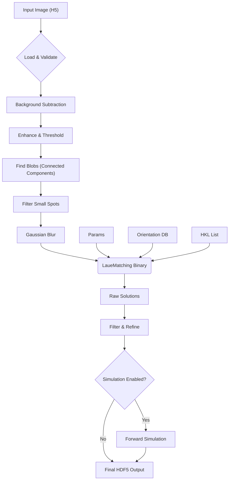

# LaueMatching v1.0

LaueMatching is a software package for indexing orientations in Laue diffraction images.

## Version History

### v1.0 (2026-02-17)
- **Code Refactor**: Consolidated ~700 lines of duplicated code into shared `LaueMatchingHeaders.h`.
- **Bug Fixes**:
  - Fixed c/a ratio fitting (was integer division `1/3`).
  - Fixed negative pixel handling (uint16_t underflow).
  - Fixed trigonal symmetry definition (consistent between CPU/GPU).
  - Fixed memory leaks and file descriptor handling.
  - Fixed GPU unique-solution indexing bug.
- **Build System**: Improved CMake configuration with working strict warning flags.

## Features

- Fast indexing of Laue diffraction patterns from polychromatic X-ray data
- CPU (OpenMP) and GPU (CUDA) implementations
- Orientation matching with configurable tolerance and crystal symmetry support
- Optional lattice-parameter refinement (including c/a ratio fitting)
- Python utilities for HKL generation, image cleanup, simulation, and analysis

## Project Structure

```
├── src/                     # C / CUDA source code
│   ├── LaueMatchingCPU.c    # CPU implementation (OpenMP)
│   ├── LaueMatchingGPU.cu   # GPU implementation (CUDA)
│   └── LaueMatchingHeaders.h
├── bin/                     # Compiled binaries (created by build)
├── LIBS/NLOPT/              # NLopt dependency (auto-downloaded)
├── simulation/              # Example data and parameter files
├── GenerateHKLs.py          # Generate valid HKL list for a crystal
├── GenerateSimulation.py    # Create synthetic Laue patterns
├── ImageCleanup.py          # Pre-process raw detector images
├── RunImage.py              # End-to-end indexing pipeline
├── CMakeLists.txt           # CMake build system
├── build.sh                 # Convenience build script
├── Makefile                 # Legacy Makefile (deprecated)
└── 100MilOrients.bin        # Pre-computed candidate orientations (~6.7 GB)
```

## Prerequisites

- **C compiler** with C99 support (GCC recommended)
- **CMake** ≥ 3.18
- **OpenMP** (usually bundled with GCC; on macOS use `brew install gcc`)
- **CUDA toolkit** (optional, only needed for the GPU build)
- **Python 3** with packages listed in `requirements.txt`

## Building

### Quick Start (CPU Only)

```bash
./build.sh
```

**Note**: This script will automatically download the required ~6.7 GB orientation database (`100MilOrients.bin`) if it is not present.

### Using CMake Directly

If you prefer to run CMake manually, you must ensure `100MilOrients.bin` is present in the root directory. You can download it by running `./build.sh` once or manually fetching it from the provided URL.

```bash
mkdir -p build && cd build
cmake .. -DUSE_CUDA=OFF -DCMAKE_BUILD_TYPE=Release
make -j$(nproc)
```

NLOPT is automatically downloaded and built into `LIBS/NLOPT/` if not already present.

### GPU Build (Requires CUDA)

```bash
./build.sh gpu
```

Or manually:
```bash
mkdir -p build && cd build
cmake .. -DUSE_CUDA=ON -DCMAKE_BUILD_TYPE=Release
make -j$(nproc)
```

Default CUDA architectures: sm_70, sm_80, sm_86, sm_90. Override with `-DCMAKE_CUDA_ARCHITECTURES="80;90"`.

### Build Options

| Option | Default | Description |
|--------|---------|-------------|
| `USE_CUDA` | `OFF` | Build the GPU executable |
| `BUILD_OMP` | `ON` | Enable OpenMP parallelism |

### Clean Build

```bash
./build.sh clean
```

## Python Requirements

Install the Python dependencies:

```bash
pip install -r requirements.txt
```

## Usage

LaueMatching is designed to be run via the Python wrapper scripts.

**See the `simulation/` directory for a complete example.**

```bash
cd simulation
cat README.md    # Instructions for generating data and running the pipeline
```

The typical workflow using `RunImage.py` (which wraps the C binary):

```bash
../RunImage.py process \
    -c params_sim.txt \
    -i simulated_1.h5 \
    -n <nCPUs>
```

### Key Parameter File Settings

| Parameter | Description |
|-----------|-------------|
| `LatticeParameter` | a, b, c (nm), α, β, γ (°) |
| `SpaceGroup` | Space group number (1–230) |
| `Elo`, `Ehi` | Energy range (keV) for spot simulation |
| `MaxNrLaueSpots` | Max spots per orientation |
| `MinNrSpots` | Minimum matching spots to qualify a grain |
| `MinIntensity` | Minimum total intensity threshold |
| `MaxAngle` | Misorientation tolerance (°) for merging candidates |

See `simulation/params_sim.txt` for a complete example.

## Best Practices

- **Linux** is the primary platform. macOS CPU builds work with `brew install gcc`.
- Place `OrientationFile` and `ForwardFile` in `/dev/shm` (tmpfs) for dramatically faster memory-mapped I/O.
- Ensure ≥ 8 GB RAM for the full 100-million orientation file.

## Citation

```bibtex
@article{LaueMatching,
  author  = {Sharma, Hemant and Sheyfer, Dina and Harder, Ross and Tischler, Jonathan Z.},
  title   = {LaueMatching: A Tool for rapid and robust indexing of Laue diffraction patterns},
  year    = {2026; in print},
  journal = {Journal of Applied Crystallography},
  url     = {https://github.com/AdvancedPhotonSource/LaueMatching}
}
```

## License

See the [LICENSE](LICENSE) file for details.


## Detailed RunImage Pipeline

The `RunImage.py` script executes a multi-stage workflow:

1. **Load Image**: Supports HDF5 paths, with fallback to raw binary loading.
2. **Background Subtraction**: Computes or loads a median background and subtracts it from the raw image.
3. **Preprocessing**: 
    - **Denoising**: Non-local means filter to reduce noise.
    - **Contrast Enhancement**: CLAHE to improve peak visibility.
    - **Edge Enhancement**: Unsharp masking to sharpen diffraction spots.
    - **Thresholding**: Adaptive, Otsu, Percentile, or Fixed thresholding.
4. **Spot Finding**: Identifies connected components (blobs) in the thresholded image and filters them by meaningful area.
5. **Blurring**: Applies a Gaussian blink based on spot spacing to connect fragmented spots for indexing.
6. **Indexing (Binary Execution)**: Calls the compiled `LaueMatchingCPU` (or GPU) executable with the blurred image, configuration, and orientation database.
7. **Post-Processing**: Parses the output solutions, filters by unique spot counts, and refines orientations.
8. **Forward Simulation**: If enabled, simulates the final orientations to verify the solution against the original image.
9. **Final Output**: Aggregates all results, logs, and simulated data into a comprehensive HDF5 file.



## Contact

Hemant Sharma — hsharma@anl.gov