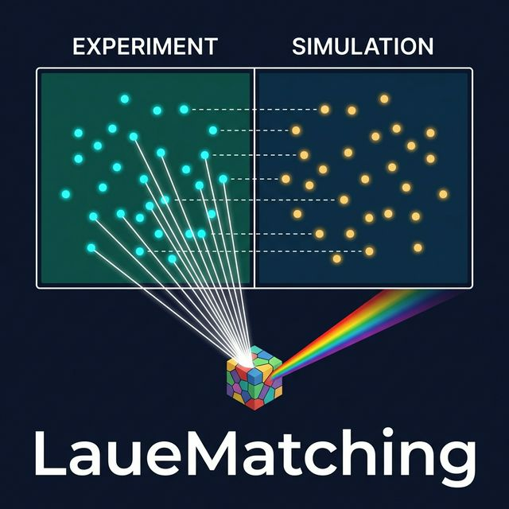
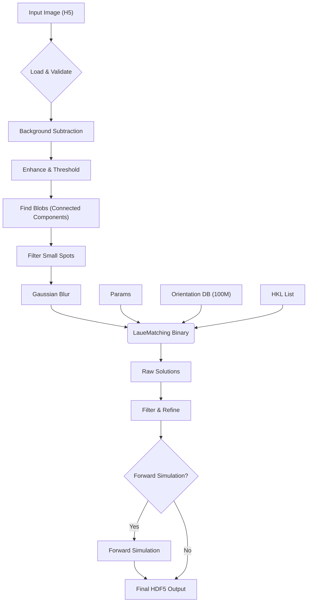
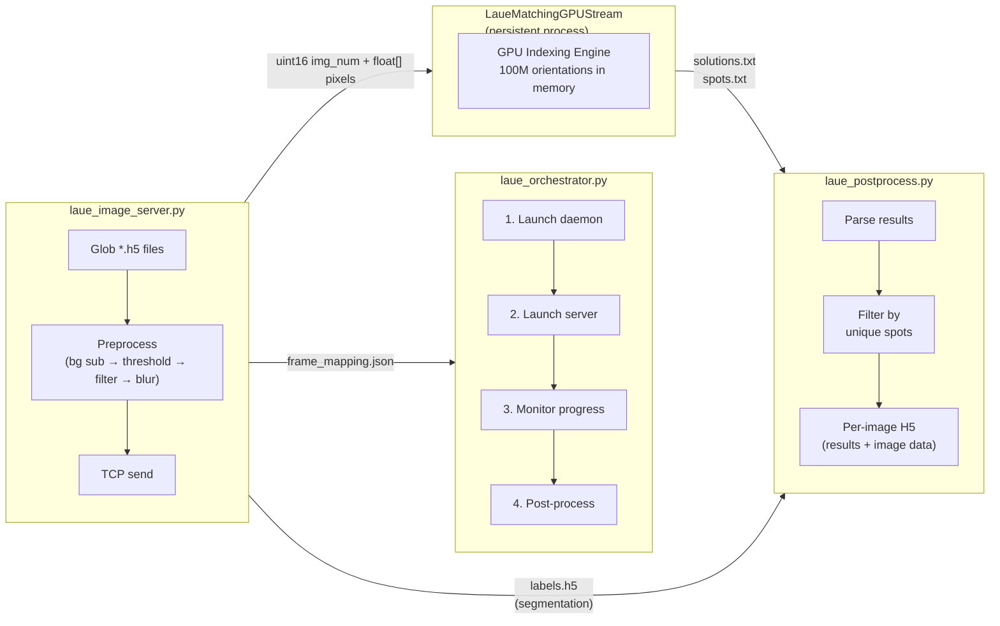

<p align="center">
  
</p>

# LaueMatching

[](LICENSE)

**LaueMatching** is a high-performance tool for indexing crystal orientations from polychromatic (Laue) X-ray diffraction images. It matches experimentally observed diffraction spot patterns against a pre-computed database of 100 million candidate orientations to rapidly determine the crystallographic orientation of each illuminated grain.

Developed at the [Advanced Photon Source](https://www.aps.anl.gov/) at Argonne National Laboratory.

**Contact:** [Hemant Sharma](mailto:hsharma@anl.gov?subject=[LaueMatching]%20From%20Github) (hsharma@anl.gov)

---

## Key Features

- **Fast Orientation Indexing** — matches Laue patterns against 100 million pre-computed orientations
- **CPU & GPU** — parallel implementations via OpenMP (CPU) and CUDA (GPU)
- **Streaming Pipeline** — persistent GPU daemon processes multiple H5 images over TCP without reloading the orientation database
- **Crystal Symmetry** — supports all crystal systems (cubic through triclinic, including trigonal)
- **Lattice Parameter Refinement** — optional c/a ratio fitting via NLopt optimization
- **End-to-End Pipeline** — Python wrappers for image preprocessing, indexing, and forward simulation validation

---

## How It Works



The `RunImage.py` script orchestrates a multi-stage workflow:

1. **Load Image** — reads HDF5 detector frames
2. **Background Subtraction** — computes or loads a median background
3. **Preprocessing** — denoising (non-local means), contrast enhancement (CLAHE), edge sharpening (unsharp mask), and thresholding (adaptive/Otsu/percentile/fixed)
4. **Spot Finding** — identifies connected components and filters by area
5. **Blurring** — Gaussian blur to connect fragmented spots for robust matching
6. **Indexing** — calls the compiled `LaueMatchingCPU` or `LaueMatchingGPU` binary
7. **Post-Processing** — filters by unique spot count, refines orientations
8. **Forward Simulation** — (optional) validates solutions against the original image
9. **Output** — aggregates results, logs, and simulations into a comprehensive HDF5 file

---

## Streaming Pipeline (Multi-Image)

For processing large datasets with many H5 images, LaueMatching provides a **streaming mode** that keeps the GPU daemon running and processes images via TCP — eliminating the overhead of reloading the 6.7 GB orientation database for each image.



**Key advantages over single-image mode:**

| | Single-Image (`RunImage.py`) | Streaming (`laue_orchestrator.py`) |
|---|---|---|
| Orientation DB | Loaded per image (~10s) | Loaded once, reused |
| GPU utilization | Idle between images | Continuous |
| Throughput | ~1 image/min | Limited only by preprocessing |
| Progress tracking | Per-image logs | Live `frame_mapping.json` with rate + ETA |
| Spot filtering | Real labels from image | Real labels carried via `labels.h5` |
| Post-processing | Serial | Parallel (`--nprocs`) |

---

## Project Structure

```
LaueMatching/
├── src/                              # C / CUDA source code
│   ├── LaueMatchingCPU.c             # CPU implementation (OpenMP)
│   ├── LaueMatchingGPU.cu            # GPU single-image (CUDA)
│   ├── LaueMatchingGPUStream.cu      # GPU streaming daemon (CUDA + TCP)
│   └── LaueMatchingHeaders.h         # Shared definitions and utilities
├── scripts/                          # Python scripts (see scripts/README.md)
│   ├── RunImage.py                   # Single-image indexing pipeline
│   ├── laue_orchestrator.py          # Streaming pipeline entry point
│   ├── laue_image_server.py          # H5 → preprocess → TCP sender
│   ├── laue_postprocess.py           # Results filtering + per-image HDF5
│   ├── laue_config.py                # Configuration dataclasses & manager
│   ├── laue_stream_utils.py          # Shared I/O, preprocessing, TCP utilities
│   ├── laue_visualization.py         # 8 standalone visualization functions
│   ├── GenerateHKLs.py               # Generate valid HKL list
│   ├── GenerateSimulation.py         # Create synthetic Laue patterns
│   └── ImageCleanup.py               # Pre-process raw detector images
├── bin/                              # Compiled binaries (created by build)
├── logos/                            # Project logo
├── LIBS/NLOPT/                       # NLopt dependency (auto-downloaded)
├── simulation/                       # Example data and parameter files
├── CMakeLists.txt                    # CMake build system
├── build.sh                          # Convenience build script
├── requirements.txt                  # Python dependencies
└── 100MilOrients.bin                 # Pre-computed orientations (~6.7 GB)
```

---

## Prerequisites

| Requirement | Details |
|-------------|---------|
| **C compiler** | C99 support (GCC recommended) |
| **CMake** | ≥ 3.18 |
| **OpenMP** | Bundled with GCC; on macOS use `brew install gcc` |
| **CUDA toolkit** | Optional, only for GPU build |
| **Python 3** | With packages in `requirements.txt` |

---

## Installation

### Quick Start (CPU Only)

```bash
git clone https://github.com/AdvancedPhotonSource/LaueMatching.git
cd LaueMatching
./build.sh
```

> **Note:** The first build automatically downloads (~6.7 GB) and reassembles the orientation database (`100MilOrients.bin`).

### Python Dependencies

```bash
pip install -r requirements.txt
```

### GPU Build (Requires CUDA)

```bash
./build.sh gpu
```

Or manually:

```bash
mkdir -p build && cd build
cmake .. -DUSE_CUDA=ON -DCMAKE_BUILD_TYPE=Release
make -j$(nproc)
```

Default CUDA architectures: sm_70, sm_80, sm_86, sm_90.

#### Custom CUDA Architectures

```bash
CMAKE_CUDA_ARCHITECTURES="75;80" ./build.sh gpu
```

#### Custom NVCC Path

```bash
CMAKE_CUDA_COMPILER=/path/to/nvcc ./build.sh gpu
```

### Build Options

| Option | Default | Description |
|--------|---------|-------------|
| `USE_CUDA` | `OFF` | Build the GPU executable |
| `BUILD_OMP` | `ON` | Enable OpenMP parallelism |

### Clean Build

```bash
./build.sh clean
```

### Using CMake Directly

Ensure `100MilOrients.bin` is present (run `./build.sh` once to download it):

```bash
mkdir -p build && cd build
cmake .. -DUSE_CUDA=OFF -DCMAKE_BUILD_TYPE=Release
make -j$(nproc)
```

NLOPT is automatically downloaded and built into `LIBS/NLOPT/` if not already present.

---

## Usage

LaueMatching is designed to be run via its Python wrapper scripts (in `scripts/`). See [scripts/README.md](scripts/README.md) for full CLI reference for every script.

### Quick Example

```bash
cd simulation
cat README.md    # Full instructions for generating data and running the pipeline
```

### Single-Image Processing

```bash
python scripts/RunImage.py process \
    -c params_sim.txt \
    -i simulated_1.h5 \
    -n <nCPUs>
```

On GPU:
```bash
python scripts/RunImage.py process \
    -c params_sim.txt \
    -i simulated_1.h5 \
    -n <nCPUs> -g
```

### Streaming Pipeline (Multi-Image, GPU)

Process an entire folder of H5 files through the persistent GPU daemon:

```bash
python scripts/laue_orchestrator.py \
    --config params.txt \
    --folder /path/to/h5_images/ \
    --h5-location /entry/data/data \
    --ncpus 8
```

This will:
1. Start the `LaueMatchingGPUStream` daemon
2. Pre-process and send each image over TCP
3. Monitor progress in real time
4. Terminate the daemon and run post-processing
5. Generate per-image H5 files and an interactive HTML visualization

Output appears in a timestamped `laue_stream_YYYYMMDD_HHMMSS/` directory.

You can also run the components individually:

```bash
# Just the image server (daemon must already be running)
python scripts/laue_image_server.py --config params.txt --folder h5s/

# Just the post-processing (on existing results)
python scripts/laue_postprocess.py --solutions solutions.txt --spots spots.txt --config params.txt
```

### Key Parameter File Settings

| Parameter | Description |
|-----------|-------------|
| `LatticeParameter` | a, b, c (nm), α, β, γ (°) |
| `SpaceGroup` | Space group number (1–230) |
| `Elo`, `Ehi` | Energy range (keV) for spot simulation |
| `MaxNrLaueSpots` | Max spots per orientation |
| `MinNrSpots` | Minimum matching spots to qualify a grain |
| `MinIntensity` | Minimum total intensity threshold |
| `MaxAngle` | Misorientation tolerance (°) for merging candidates |
| `Optimizer` | `NelderMead` to use Nelder-Mead; default is BOBYQA (faster) |

See `simulation/params_sim.txt` for a complete example.

---

## Performance Tips

- **Linux** is the primary platform. macOS CPU builds work with `brew install gcc`.
- Place `OrientationFile` and `ForwardFile` in `/dev/shm` (tmpfs) for dramatically faster memory-mapped I/O.
- Ensure ≥ 8 GB RAM for the full 100-million orientation file.
- Use the GPU build for large-scale datasets — it provides significant speedup over CPU.
- The default optimizer (BOBYQA) converges in ~2–3× fewer iterations than Nelder-Mead. Add `Optimizer NelderMead` to the parameter file only if needed.

---

## Citation

If you use LaueMatching in your research, please cite:

```bibtex
@article{LaueMatching,
  author  = {Sharma, Hemant and Sheyfer, Dina and Harder, Ross and Tischler, Jonathan Z.},
  title   = {LaueMatching: A Tool for rapid and robust indexing of Laue diffraction patterns},
  year    = {2026; in print},
  journal = {Journal of Applied Crystallography},
  url     = {https://github.com/AdvancedPhotonSource/LaueMatching}
}
```

---

## Version History

### v2.0 (2026-02-18)

- **Streaming Pipeline**: New `LaueMatchingGPUStream` CUDA daemon + Python orchestrator for multi-image processing over TCP.
- **Float32 Wire Protocol**: Image transfer uses float32 (16 MB/frame for 2048×2048) instead of float64, halving bandwidth with no precision loss in GPU matching.
- **Pipelined Image Server**: Producer-consumer threading overlaps H5 loading/preprocessing with TCP sending.
- **Progress Bar**: Real-time tqdm progress bar with throughput (img/s) and ETA.
- **Graceful Daemon Shutdown**: Handles unresponsive GPU processes without crashing the pipeline.
- **Scripts Reorganization**: All Python scripts moved to `scripts/` directory with comprehensive `scripts/README.md`.
- **Module Decomposition**: Decomposed `RunImage.py` (3,553 → 1,673 lines) into reusable modules:
  - `laue_config.py` (782 lines) — configuration dataclasses and parameter file parser.
  - `laue_stream_utils.py` (1,108 lines) — image I/O, preprocessing, TCP wire protocol, orientation sorting/filtering.
  - `laue_visualization.py` (937 lines) — 8 standalone visualization functions (Plotly interactive, simulation comparison, reports, etc.).
- **Post-Processing**: `laue_postprocess.py` now sorts filtered orientations by quality and supports optional per-image interactive visualization.
- **Streaming Utilities**: `laue_image_server.py` for TCP image sending with live progress tracking; `laue_orchestrator.py` for full pipeline management.

### v1.0 (2026-02-17)

- **Code Refactor**: Consolidated ~700 lines of duplicated code into shared `LaueMatchingHeaders.h`.
- **Bug Fixes**:
  - Fixed c/a ratio fitting (was integer division `1/3`).
  - Fixed negative pixel handling (uint16_t underflow).
  - Fixed trigonal symmetry definition (consistent between CPU/GPU).
  - Fixed memory leaks and file descriptor handling.
  - Fixed GPU unique-solution indexing bug.
- **Build System**: Improved CMake configuration with working strict warning flags.
- **Performance**: Hoisted memory allocations out of critical loops; added `gpuErrchk` macro for CUDA error handling.

---

## License

See the [LICENSE](LICENSE) file for details.

Copyright © UChicago Argonne, LLC. All rights reserved.

> This product includes software produced by UChicago Argonne, LLC under Contract No. DE-AC02-06CH11357 with the Department of Energy.