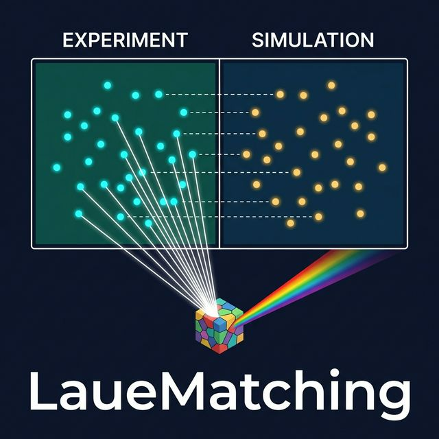
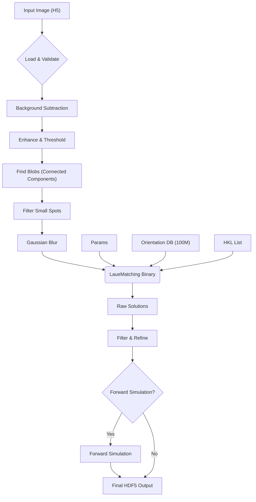
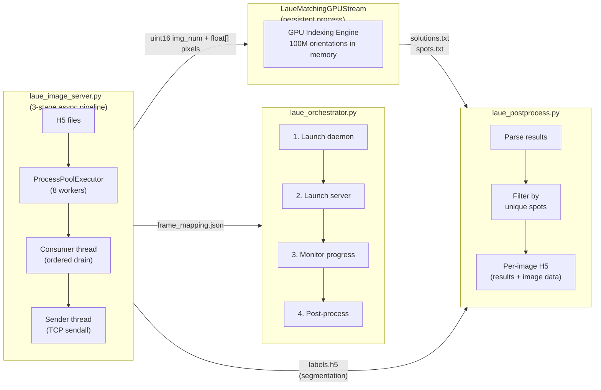
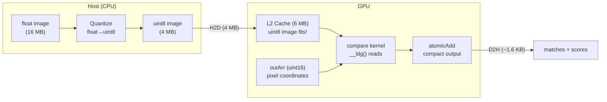

<p align="center">
  
</p>

# LaueMatching

[](LICENSE)

**LaueMatching** is a high-performance tool for indexing crystal orientations from polychromatic (Laue) X-ray diffraction images. It matches experimentally observed diffraction spot patterns against a pre-computed database of 100 million candidate orientations to rapidly determine the crystallographic orientation of each illuminated grain.

Developed at the [Advanced Photon Source](https://www.aps.anl.gov/) at Argonne National Laboratory.

**Contact:** [Hemant Sharma](mailto:hsharma@anl.gov?subject=[LaueMatching]%20From%20Github) (hsharma@anl.gov)

---

## Where to go

| I want to | Read |
|---|---|
| index one image, or install | this file — [Installation](#installation), [Usage](#usage) |
| take a whole dataset from an experiment folder to a reported grain map | **[`manuals/laue/README.md`](manuals/laue/README.md)** — the doc set: scope gate, seven phases, halt conditions |
| run the many-grain campaign pipeline on a beamline | [`pipeline/README.md`](pipeline/README.md) |
| work out why a result looks wrong | [`manuals/laue/DIAGNOSIS.md`](manuals/laue/DIAGNOSIS.md) — symptom → discriminating test → cause |
| try it on synthetic data first | [`simulation/README.md`](simulation/README.md) |
| call the Python from my own code | [`packages/laue_index/laue_index/README.md`](packages/laue_index/laue_index/README.md), [`scripts/README.md`](scripts/README.md) |
| differentiate the forward model | [`docs/torch-forward-model.md`](docs/torch-forward-model.md), [`packages/laue_torch/README.md`](packages/laue_torch/README.md) |
| know what changed | [`CHANGELOG.md`](CHANGELOG.md) |

---

## Key Features

- **Fast Orientation Indexing** — matches Laue patterns against 100 million pre-computed orientations
- **CPU & GPU** — parallel implementations via OpenMP (CPU) and CUDA (GPU)
- **Streaming Pipeline** — persistent GPU daemon processes multiple H5 images over TCP without reloading the orientation database
- **Crystal Symmetry** — supports all crystal systems (cubic through triclinic, including trigonal)
- **Lattice Parameter Refinement** — optional c/a ratio fitting, via a vendored Nelder–Mead simplex (no external optimizer dependency)
- **End-to-End Pipeline** — Python wrappers for image preprocessing, indexing, and forward simulation validation
- **Differentiable Forward Model** — `laue_torch` PyTorch package for gradient-based geometry calibration, orientation refinement, strain fitting, and ODF inference; see [docs/torch-forward-model.md](docs/torch-forward-model.md)

---

## How It Works


```mermaid
graph TD
    Input["Input Image (H5)"] --> Load{"Load & Validate"}
    Load --> BgSub["Background Subtraction"]
    BgSub --> Preproc["Enhance & Threshold"]
    Preproc --> Blobs["Find Blobs (Connected Components)"]
    Blobs --> Filter["Filter Small Spots"]
    Filter --> Blur["Gaussian Blur"]

    Blur --> Indexer("LaueMatching Binary")
    Config[Params] --> Indexer
    Orients["Orientation DB (100M)"] --> Indexer
    HKLs["HKL List"] --> Indexer

    Indexer --> Results["Raw Solutions"]
    Results --> PostProc["Filter & Refine"]
    PostProc --> Sim{"Forward Simulation?"}

    Sim -- Yes --> FwdSim["Forward Simulation"]
    FwdSim --> Output["Final HDF5 Output"]
    Sim -- No --> Output
```

The `RunImage.py` script orchestrates a multi-stage workflow:

1. **Load Image** — reads HDF5 detector frames
2. **Background Subtraction** — computes or loads a median background
3. **Preprocessing** — denoising (non-local means), contrast enhancement (CLAHE), edge sharpening (unsharp mask), and thresholding (adaptive/Otsu/percentile/fixed)
4. **Spot Finding** — identifies connected components and filters by area
5. **Blurring** — Gaussian blur to connect fragmented spots for robust matching
6. **Indexing** — calls the compiled `LaueMatchingCPU` or `LaueMatchingGPU` binary
7. **Post-Processing** — filters by unique spot count, refines orientations
8. **Forward Simulation** — (optional) validates solutions against the original image
9. **Output** — aggregates results, logs, and simulations into a comprehensive HDF5 file

---

## Streaming Pipeline (Multi-Image)

For processing large datasets with many H5 images, LaueMatching provides a **streaming mode** that keeps the GPU daemon running and processes images via TCP — eliminating the overhead of reloading the 6.7 GB orientation database for each image.


```mermaid
flowchart LR
    subgraph Orchestrator ["laue_orchestrator.py"]
        direction TB
        S1["1. Launch daemon"]
        S2["2. Launch server"]
        S3["3. Monitor progress"]
        S4["4. Post-process"]
        S1 --> S2 --> S3 --> S4
    end

    subgraph Daemon ["LaueMatchingGPUStream<br/>(persistent process)"]
        GPU["GPU Indexing Engine<br/>100M orientations in memory"]
    end

    subgraph Server ["laue_image_server.py<br/>(3-stage async pipeline)"]
        direction TB
        H5["H5 files"] --> Pool["ProcessPoolExecutor<br/>(8 workers)"]
        Pool --> Consumer["Consumer thread<br/>(ordered drain)"]
        Consumer --> Send["Sender thread<br/>(TCP sendall)"]
    end

    subgraph PostProc ["laue_postprocess.py"]
        direction TB
        Parse["Parse results"] --> Filter["Filter by<br/>unique spots"] --> Out["Per-image H5<br/>(results + image data)"]
    end

    Server -- "uint16 img_num + float[] pixels" --> Daemon
    Daemon -- "solutions.txt<br/>spots.txt" --> PostProc
    Server -- "frame_mapping.json" --> Orchestrator
    Server -- "labels.h5<br/>(segmentation)" --> PostProc
```

### GPU Kernel Data Flow


```mermaid
flowchart LR
    subgraph Host ["Host (CPU)"]
        ImgF["float image<br/>(16 MB)"] --> Q8["Quantize<br/>float→uint8"]
        Q8 --> ImgU8["uint8 image<br/>(4 MB)"]
    end

    subgraph Device ["GPU"]
        L2["L2 Cache (6 MB)<br/>uint8 image fits!"]
        OutArr["outArr (uint16)<br/>pixel coordinates"]
        Kernel["compare kernel<br/>__ldg() reads"]
        Compact["atomicAdd<br/>compact output"]
        L2 --> Kernel
        OutArr --> Kernel
        Kernel --> Compact
    end

    ImgU8 -- "H2D (4 MB)" --> L2
    Compact -- "D2H (~1.6 KB)" --> Results["matches + scores"]
```

**Key advantages over single-image mode:**

| | Single-Image (`RunImage.py`) | Streaming (`laue_orchestrator.py`) |
|---|---|---|
| Orientation DB | Loaded per image (~10s) | Loaded once, reused |
| GPU utilization | Idle between images | Continuous |
| Throughput | ~1 image/min | Limited only by preprocessing |
| Progress tracking | Per-image logs | Live `frame_mapping.json` with rate + ETA |
| Spot filtering | Real labels from image | Real labels carried via `labels.h5` |
| Post-processing | Serial | Parallel (`--nprocs`) |

---

## Project Structure

```
LaueMatching/
├── packages/                          # Python distributions, each pip-installable
│   ├── laue_index/                    #   the pipeline: Python core + the C/CUDA indexer
│   │   ├── c_src/                     #     C / CUDA source — the ONLY copy
│   │   │   ├── LaueMatchingCPU.c      #       CPU indexer (OpenMP)
│   │   │   ├── LaueMatchingGPU.cu     #       GPU single-image (CUDA)
│   │   │   ├── LaueMatchingGPUStream.cu #     GPU streaming daemon (CUDA + TCP)
│   │   │   ├── LaueMatchingHeaders.h  #       shared structs, constants, utilities
│   │   │   └── nelder_mead.c          #       vendored simplex (no NLopt dependency)
│   │   ├── CMakeLists.txt             #     compiles c_src/ at `pip install` time
│   │   ├── laue_index/                #     typed pipeline stages (records, geometry,
│   │   │   │                          #     filtering, thresholds, preprocess, indexer,
│   │   │   │                          #     postprocess, output, config_schema, cli)
│   │   │   └── pipeline/              #     the orchestrators, shipped with the package
│   │   │                              #     (RunImage, laue_orchestrator, image server,
│   │   │                              #      postprocess, GenerateHKLs/Simulation, …)
│   │   └── tests/                     #     characterization suite + golden anchors
│   ├── laue_torch/                    #   differentiable PyTorch forward + ODF/SDF recovery
│   └── laue_jax/                      #   JAX port of the forward model (JAX-CPFEM bridge)
├── manuals/laue/                      # the doc set: spine + 7 phases, diagnosis, notebooks
├── pipeline/                          # many-grain campaign pipeline
│   ├── run_laue.sh                    #   the one launcher (CONFIG block at the top)
│   ├── launch_shard.sh                #   one orchestrator per GPU / host
│   ├── params_*.template.txt          #   annotated parameter templates, one per phase
│   └── analysis/                      #   analysis chain (carries hardcoded lattice
│                                      #   constants — port before another material)
├── scripts/                           # entry-point shims onto laue_index/pipeline/
├── simulation/                        # worked example: generate a pattern, index it back
├── docs/                              # reference: index-file format, provenance, torch model
├── utils/                             # repo tooling (scrub_check)
├── CMakeLists.txt / build.sh          # root build; reaches down into packages/laue_index/c_src/
├── Containerfile / .containerignore   # Podman images (CPU and CUDA); must stay at the root
├── bin/                               # compiled binaries (created by ./build.sh)
├── CHANGELOG.md                       # version history
└── 100MilOrients.bin                  # pre-computed orientations, ~6.7 GB (not in git)
```

The Python side is a small package of **typed pipeline stages** (`laue_index`)
with **strategy objects** for the two things that vary (thresholding,
orientation filtering) and one declarative config schema.  The orchestrators
(`RunImage.py`, the streaming pipeline) live in `laue_index/pipeline/` so they
ship with the package — `pip install laue-index` gives you the library, the C
binaries **and** something that can run a frame through them.  `scripts/` keeps
a one-line shim for each, so `python scripts/RunImage.py …` and the shell
pipeline work unchanged from a checkout.
See [scripts/README.md](scripts/README.md) and
[packages/laue_index/laue_index/README.md](packages/laue_index/laue_index/README.md).

---

## Prerequisites

| Requirement | Details |
|-------------|---------|
| **C compiler** | C99 support (GCC recommended) |
| **CMake** | ≥ 3.18 |
| **OpenMP** | Bundled with GCC; on macOS use `brew install gcc` |
| **CUDA toolkit** | Optional — for `./build.sh gpu`, or `LAUEMATCHING_CUDA=1 pip install laue-index` |
| **Python 3** | ≥ 3.9. `pip install 'laue-index[run]'` covers the full pipeline |

---

## Installation

### From PyPI

```bash
pip install 'laue-index[run]'          # the full pipeline + the CPU indexer
pip install laue-index                 # library + indexer only (numpy)
pip install laue-torch                 # differentiable forward model (PyTorch)
pip install laue-jax                   # JAX port

LAUEMATCHING_CUDA=1 pip install 'laue-index[run]'   # + the CUDA binaries (see below)
```

That is enough to index without cloning anything:

```bash
laue-index fetch-db --dest ~/laue                 # the 6.7 GB orientation database
export LAUEMATCHING_ORIENT_DB=~/laue/100MilOrients.bin
laue-index run process -c params.txt -i frame.h5 -n 8
```

`laue-index` ships as an **sdist**: the C indexer is compiled on your machine at
install time, so a C compiler and OpenMP must be present. If they are not, the
install still succeeds and the Python side works — only the indexing binary is
missing, and `laue_index.indexer.available()` reports `False`. See
[Getting the indexer binary](#getting-the-indexer-binary).

The orientation database is **not** part of the package — it is 6.7 GB.
`laue-index fetch-db` downloads and reassembles it from the
[v1.0-data release](https://github.com/AdvancedPhotonSource/LaueMatching/releases/tag/v1.0-data);
`./build.sh` fetches it too, in a checkout. Point runs at it with
`LAUEMATCHING_ORIENT_DB`, or name it as `OrientationFile` in the config. Copy it
to `/dev/shm` first if you can spare the RAM: the indexer mmaps it from there
instead of reading it.

### From Source (CPU)

```bash
git clone https://github.com/AdvancedPhotonSource/LaueMatching.git
cd LaueMatching
./build.sh
```

Binaries land in `bin/`. The first build also downloads and reassembles the
orientation database (`100MilOrients.bin`, ~6.7 GB); set `SKIP_DOWNLOAD=1` to
skip that.

For the Python side from a checkout:

```bash
pip install -e packages/laue_index      # or laue_torch / laue_jax
pip install -r requirements.txt         # script dependencies only
```

### Containers (Podman)

APS runs [Podman, not Docker](https://git.aps.anl.gov/groups/bdp-public/-/wikis/Software-Containers) —
the two cannot coexist on a host — so the image definition is a
[`Containerfile`](Containerfile) and every command below is the Podman one. It
is plain OCI, so `docker build` works too where Docker is what you have.

```bash
podman build --target cpu  -t laue:cpu  .
podman build --target cuda -t laue:cuda .
```

The orientation database is **not** baked in (6.7 GB); mount it. GPUs arrive
through the NVIDIA Container Toolkit's CDI interface — `--device`, not Docker's
`--gpus`:

```bash
podman run --rm -v /local/$USER/data:/data:Z laue:cpu \
    LaueMatchingCPU params.txt /data/100MilOrients.bin hkls.csv img.bin 8

podman run --rm --device nvidia.com/gpu=all -v /local/$USER/data:/data:Z \
    laue:cuda LaueMatchingGPU params.txt /data/100MilOrients.bin hkls.csv img.bin 8
```

Verified on an APS host: one `laue:cuda` image, built with no GPU present,
indexed the same 2302 orientations on an **H200 (sm_90)** and an **RTX PRO 6000
Blackwell (sm_120)** — 85.1 s and 85.0 s, matching the bare-metal run. That is
the architecture default earning its keep: a container build has no local card
to ask about, so a binary built "for this machine" would have been built for
nothing.

Two APS-specific notes. Image storage needs no setup — the site-wide
`/etc/containers/storage.conf` already puts the graphroot on local (non-NFS)
`/local`. But if a build fails with "no space left on device" while `/local` has
room, it is `/var/tmp` filling up, since Podman extracts layers through it:

```bash
mkdir -p /local/$USER/tmp && export TMPDIR=/local/$USER/tmp
```

For a daemon that should survive a reboot, wrap `LaueMatchingGPUStream` in a
Quadlet `.container` unit rather than a shell loop. The registry is APS GitLab,
which reaches the beamline private subnets.

### Getting the indexer binary

The Python wrapper searches these locations **in order** and uses the first that
exists:

| # | Location | Typical case |
|---|----------|--------------|
| 1 | `$LAUEMATCHING_BIN` | explicit override — a file, or a directory holding the binaries |
| 2 | `<site-packages>/laue_index/bin/` | compiled by `pip install laue-index` |
| 3 | `$PATH` | a release tarball unpacked somewhere |
| 4 | `<repo>/bin/` | a source checkout |

`LAUEMATCHING_BIN` is the escape hatch for everything the build cannot do for
you — a binary from a release, one built elsewhere, one shared across a beamline:

```bash
export LAUEMATCHING_BIN=/path/to/LaueMatching/bin     # directory, or
export LAUEMATCHING_BIN=/path/to/LaueMatchingGPU      # a single executable
```

#### CUDA from pip

The GPU binaries are built at install time too, but **only when asked**:

```bash
LAUEMATCHING_CUDA=1 pip install laue-index
# or, equivalently:
pip install laue-index --config-settings=cmake.define.LAUE_CUDA=ON
```

This needs the CUDA toolkit (`nvcc`), not merely a driver, and costs a few
seconds of extra compile. It is opt-in rather than automatic on purpose: a
toolkit that cannot compile these sources fails at *build* time, which would
kill the whole install — including the CPU binary that would otherwise have
worked. Without the variable you get exactly today's CPU-only install.

**The binary runs on any card the toolkit knows.** The build asks
`nvcc --list-gpu-arch` and compiles real code for every architecture it names,
plus PTX for the newest as a JIT path for cards that do not exist yet. It does
**not** build for the card in the build machine: PTX JIT works forward and never
backward, so a binary built on a newer GPU than it runs on fails — and fails
*silently*, indexing nothing and exiting 0. Override with
`--config-settings=cmake.define.CMAKE_CUDA_ARCHITECTURES=native` for a fast
local build you will not move.

If `nvcc` is missing the install still succeeds, with a warning and no GPU
binary. Check what you got:

```python
from laue_index import indexer
indexer.available("GPU")        # True if LaueMatchingGPU is usable
indexer.binary_path("GPU")      # where it came from
```

**Prebuilt binaries** are attached to every release, built by CI and usable
without a compiler:

| Asset | Built on | Notes |
|-------|----------|-------|
| `LaueMatchingCPU` | ubuntu-latest, glibc 2.39 | OpenMP |
| `LaueMatchingGPU` | CUDA 12.6, ubuntu 24.04 | single-image |
| `LaueMatchingGPUStream` | CUDA 12.6, ubuntu 24.04 | streaming daemon |

The CUDA assets carry real code for every architecture the 12.6 toolkit knows,
plus PTX for the newest — so a card newer than that toolkit JITs rather than
failing. Building from source on a machine with a newer toolkit gives native
code for newer cards.

```bash
gh release download laue-index-v0.2.0 -p 'LaueMatching*'
chmod +x LaueMatching*
export LAUEMATCHING_BIN="$PWD"
```

If nothing is found, the error names every path it tried and points at
`LAUEMATCHING_BIN` — it is never a silent failure.

### GPU Build (Requires CUDA)

```bash
./build.sh gpu
```

Or manually:

```bash
mkdir -p build && cd build
cmake .. -DUSE_CUDA=ON -DCMAKE_BUILD_TYPE=Release
make -j$(nproc)
```

By default the build asks `nvcc --list-gpu-arch` and compiles for **every**
architecture that toolkit supports, plus PTX for the newest. On CUDA 13.3 that
is `sm_75 … sm_121` and `compute_121` PTX: ~1.3 MB, a few minutes, and it runs
on any card the toolkit knows plus, via JIT, ones it does not.

There was a hardcoded `70;80;86;90` here once. It failed to configure on CUDA 13
(`nvcc fatal : Unsupported gpu architecture 'compute_70'` — Volta was dropped)
and it covered nothing past Hopper.

#### Custom CUDA Architectures

```bash
CMAKE_CUDA_ARCHITECTURES="native" ./build.sh gpu     # this machine's cards only
CMAKE_CUDA_ARCHITECTURES="90;120" ./build.sh gpu     # an explicit list
```

> **Do not narrow this for a binary you will move.** PTX JIT works forward, not
> backward, so a binary built for a newer card than it runs on has neither a
> matching cubin nor usable PTX — and it does not crash. Measured: an
> sm_120-only build on an sm_90 card exits **0** having found **zero**
> orientations. The launch error is now checked, so that case fails loudly, but
> the way not to meet it is to keep the default.

#### Custom NVCC Path

```bash
CMAKE_CUDA_COMPILER=/path/to/nvcc ./build.sh gpu
```

### Build Options

| Option | Default | Description |
|--------|---------|-------------|
| `USE_CUDA` | `OFF` | Build the GPU executable |
| `BUILD_OMP` | `ON` | Enable OpenMP parallelism |

### Clean Build

```bash
./build.sh clean
```

### Using CMake Directly

Ensure `100MilOrients.bin` is present (run `./build.sh` once to download it):

```bash
mkdir -p build && cd build
cmake .. -DUSE_CUDA=OFF -DCMAKE_BUILD_TYPE=Release
make -j$(nproc)
```

There is nothing to download and no external library to find: the optimizer
(`packages/laue_index/c_src/nelder_mead.c`) is vendored into the tree, so the build is offline and
self-contained.

---

## Usage

LaueMatching is designed to be run via its Python wrapper scripts (in `scripts/`). See [scripts/README.md](scripts/README.md) for full CLI reference for every script.

### Quick Example

```bash
cd simulation
cat README.md    # Full instructions for generating data and running the pipeline
```

### Single-Image Processing

```bash
python scripts/RunImage.py process \
    -c params_sim.txt \
    -i simulated_1.h5 \
    -n <nCPUs>
```

On GPU:
```bash
python scripts/RunImage.py process \
    -c params_sim.txt \
    -i simulated_1.h5 \
    -n <nCPUs> -g
```

### Streaming Pipeline (Multi-Image, GPU)

Process an entire folder of H5 files through the persistent GPU daemon:

```bash
python scripts/laue_orchestrator.py \
    --config params.txt \
    --folder /path/to/h5_images/ \
    --h5-location /entry/data/data \
    --ncpus 8
```

This will:
1. Start the `LaueMatchingGPUStream` daemon
2. Pre-process and send each image over TCP
3. Monitor progress in real time
4. Terminate the daemon and run post-processing
5. Generate per-image H5 files and an interactive HTML visualization

Output appears in a timestamped `laue_stream_YYYYMMDD_HHMMSS/` directory.

You can also run the components individually:

```bash
# Just the image server (daemon must already be running)
python scripts/laue_image_server.py --config params.txt --folder h5s/

# Just the post-processing (on existing results)
python scripts/laue_postprocess.py --solutions solutions.txt --spots spots.txt --config params.txt
```

### Key Parameter File Settings

| Parameter | Description |
|-----------|-------------|
| `LatticeParameter` | a, b, c (nm), α, β, γ (°) |
| `SpaceGroup` | Space group number (1–230) |
| `Elo`, `Ehi` | Energy range (keV) for spot simulation |
| `MaxNrLaueSpots` | Max spots per orientation |
| `MinNrSpots` | Minimum matching spots to qualify a grain |
| `MinIntensity` | Minimum total intensity threshold |
| `MaxAngle` | Misorientation tolerance (°) for merging candidates |
| `Optimizer` | `NelderMead` to use Nelder-Mead; default is BOBYQA (faster) |

See `simulation/params_sim.txt` for a complete example.

---

## Performance

### GPU Kernel Optimizations

| Optimization | Before | After | Improvement |
|---|---|---|---|
| **Float32 kernel** | double (273 ms) | float (273 ms) | Enables uint8 path |
| **Compact output (atomicAdd)** | D2H 800 MB dense | D2H ~1.6 KB | Eliminated bottleneck |
| **uint8 image quantization** | 16 MB (L2 miss) | 4 MB (L2 hit) | **2.5× kernel speedup** |
| **Overall GPU time** | 275 ms | **120 ms** | **2.3×** |

> The `compare` kernel reads scattered image pixels via `__ldg()` from uint8 image data (4 MB, fits in the GPU's 6 MB L2 cache). Each pixel read is multiplied by a per-image scale factor to recover approximate intensity. Nonzero pixels are guaranteed to map to at least uint8 value 1, preserving spot counts exactly.

### General Tips

- **Linux** is the primary platform. macOS CPU builds work with `brew install gcc`.
- Place `OrientationFile` and `ForwardFile` in `/dev/shm` (tmpfs) for dramatically faster memory-mapped I/O.
- Ensure ≥ 8 GB RAM for the full 100-million orientation file.
- Use the GPU build for large-scale datasets — it provides significant speedup over CPU.
- The default optimizer (BOBYQA) converges in ~2–3× fewer iterations than Nelder-Mead. Add `Optimizer NelderMead` to the parameter file only if needed.

---

## Testing

Each package in `packages/` carries its own suite and is tested from its own
directory.

**`laue_index`** is built on **golden characterization anchors** — small
fixtures pin the current behaviour of each pipeline stage (parsing,
thresholding, filtering, geometry, config round-trip, preprocessing) so
refactors are provably behaviour-preserving.

```bash
cd packages/laue_index
pip install -e '.[dev]'
pytest                      # unit suite (no orientation DB or C binary needed)
```

The full end-to-end test (`tests/test_char_e2e.py`) runs the real
`RunImage → indexer → filter` pipeline and is **opt-in** — it needs the
orientation DB, the built C binary, and a prebuilt forward cache:

```bash
LAUE_E2E=1 pytest tests/test_char_e2e.py
```

Without `LAUE_E2E=1` it skips, so CI stays green with `SKIP_DOWNLOAD=1` (the
6.7 GB database is not required for the unit suite). A mocked-indexer test
(`tests/test_runimage_orchestration.py`) covers RunImage's orchestration without
the binary or DB. To regenerate a golden after an *intentional* behaviour change:
`UPDATE_GOLDEN=1 pytest`.

`tests/test_cold_forward_cache.py` runs the real binary on the path no other
test took — the run that *writes* the forward cache — with a few-thousand-orientation
database it builds itself, so it costs seconds rather than the ~16 minutes a
real cold run does. It needs `/dev/shm` (the C only mmaps the database from
there, and the bug it guards existed only on that path) and skips elsewhere.

**`laue_torch`** and **`laue_jax`** are tested the same way:

```bash
cd packages/laue_torch && pip install -e '.[dev]' && pytest
cd packages/laue_jax   && pip install -e '.[dev]' && pytest
```

`laue_torch`'s parity tests compare the differentiable forward against the
repository's reference NumPy/C simulator, so they need a real checkout
(`simulation/`, `scripts/`). Run from an installed wheel instead and they skip
cleanly rather than failing.

---

## Citation

If you use LaueMatching in your research, please cite:

H. Sharma, D. Sheyfer, R. Harder and J.Z. Tischler (2026). *J. Appl. Cryst.* **59**, [https://doi.org/10.1107/S1600576726001196](https://doi.org/10.1107/S1600576726001196)

```bibtex
@article{LaueMatching,
  author  = {Sharma, Hemant and Sheyfer, Dina and Harder, Ross and Tischler, Jonathan Z.},
  title   = {LaueMatching: A Tool for rapid and robust indexing of Laue diffraction patterns},
  year    = {2026},
  journal = {Journal of Applied Crystallography},
  volume  = {59},
  doi     = {10.1107/S1600576726001196},
  url     = {https://doi.org/10.1107/S1600576726001196}
}
```

---

## Version History

See [CHANGELOG.md](CHANGELOG.md).

---

## License

See the [LICENSE](LICENSE) file for details.

Copyright © UChicago Argonne, LLC. All rights reserved.

> This product includes software produced by UChicago Argonne, LLC under Contract No. DE-AC02-06CH11357 with the Department of Energy.