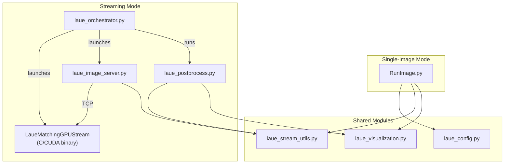

# LaueMatching Scripts

Python scripts for image preprocessing, orientation indexing, streaming pipeline orchestration, post-processing, and visualization.

> **Tip:** For a quick-start walkthrough with example data, see the [simulation/README.md](../simulation/README.md).

---

## Script Overview

| Script | Lines | Description |
|--------|------:|-------------|
| `RunImage.py` | 1,673 | **Single-image indexing pipeline** — load, preprocess, index, refine, and export results for one H5 image. |
| `laue_orchestrator.py` | 465 | **Streaming pipeline entry-point** — launches the GPU daemon, image server, monitors progress with tqdm bar, and runs post-processing. |
| `laue_image_server.py` | 389 | **TCP image sender** — reads H5 files, preprocesses frames, and sends them to the GPU daemon over TCP with pipelined threading. |
| `laue_postprocess.py` | 598 | **Stream results post-processor** — splits daemon output by image, filters by unique spots, saves per-image HDF5 + Plotly HTML. |
| `laue_config.py` | 782 | **Configuration module** — dataclasses for processing, visualization, and optimizer settings; parameter file parser. |
| `laue_stream_utils.py` | 1,108 | **Shared utilities** — image I/O, preprocessing, TCP wire protocol (float32), HDF5 helpers, orientation sort/filter. |
| `laue_visualization.py` | 937 | **Visualization library** — 8 standalone Plotly/Matplotlib functions for interactive spot maps, 3D views, reports, and simulation comparisons. |
| `GenerateSimulation.py` | 532 | **Forward simulation** — generates synthetic Laue patterns from known orientation matrices. |
| `GenerateHKLs.py` | 396 | **HKL generator** — computes valid Miller indices for a crystal's space group and energy range. |
| `ImageCleanup.py` | 297 | **Image pre-processing** — background subtraction, contrast enhancement, thresholding, spot filtering. |

---

## Module Architecture



---

## Single-Image Pipeline (`RunImage.py`)

Process a single H5 image through the full indexing pipeline.

### Subcommands

| Subcommand | Description |
|------------|-------------|
| `process` | Run the full pipeline (preprocess → index → refine → export) |
| `view` | Generate interactive Plotly HTML from existing HDF5 results |
| `report` | Generate a comprehensive analysis report from HDF5 results |

### Usage

```bash
# Process on CPU
python scripts/RunImage.py process \
    -c params.txt \
    -i image.h5 \
    -n 8

# Process on GPU
python scripts/RunImage.py process \
    -c params.txt \
    -i image.h5 \
    -n 8 -g

# View results interactively
python scripts/RunImage.py view -i results/image.output.h5

# Generate analysis report
python scripts/RunImage.py report -i results/image.output.h5 -o report.html
```

### Key Flags

| Flag | Description |
|------|-------------|
| `-c`, `--config` | Path to `params.txt` configuration file |
| `-i`, `--input` | Input H5 image file |
| `-n`, `--ncpus` | Number of CPU threads |
| `-g`, `--gpu` | Use GPU indexer instead of CPU |
| `--no-viz` | Skip visualization generation |
| `--no-simulation` | Skip forward simulation validation |
| `--loglevel` | `DEBUG`, `INFO`, `WARNING`, `ERROR` |
| `--logfile` | Path to log file (in addition to stderr) |

---

## Streaming Pipeline

For processing datasets with hundreds or thousands of H5 images, the streaming pipeline keeps the GPU daemon running persistently and processes images over TCP — eliminating the ~10 s overhead of re-loading the 6.7 GB orientation database for each image.

### Quick Start

```bash
python scripts/laue_orchestrator.py \
    --config params.txt \
    --folder /path/to/h5_images/ \
    --ncpus 8
```

This will:

1. **Launch** the `LaueMatchingGPUStream` daemon (loads orientations once)
2. **Start** the image server (preprocesses and sends frames over TCP)
3. **Monitor** progress with live rate + ETA
4. **Terminate** the daemon after all images are processed
5. **Post-process** results (filter, sort, save per-image HDF5 + interactive HTML)

Output is written to a timestamped `laue_stream_YYYYMMDD_HHMMSS/` directory.

### Running Components Individually

Each component can also be run standalone, for example to re-run post-processing on existing results:

```bash
# Image server only (daemon must already be running)
python scripts/laue_image_server.py \
    --config params.txt \
    --folder /path/to/h5s/ \
    --port 60517

# Post-processing only (on existing daemon output)
python scripts/laue_postprocess.py \
    --solutions solutions.txt \
    --spots spots.txt \
    --config params.txt \
    --output-dir results/
```

### `laue_orchestrator.py` — CLI Reference

| Flag | Default | Description |
|------|---------|-------------|
| `--config` | *(required)* | Path to `params.txt` |
| `--folder` | *(required)* | Folder containing `.h5` image files |
| `--h5-location` | `/entry/data/data` | Internal HDF5 dataset path |
| `--ncpus` | `1` | Number of CPUs for the daemon process |
| `--output-dir` | auto-timestamped | Output directory |
| `--port` | `60517` | Daemon TCP port |
| `--port-timeout` | `180` | Max seconds to wait for daemon startup |
| `--flush-time` | `5` | Seconds to wait after server finishes before killing daemon |
| `--min-unique` | `2` | Minimum unique spots for orientation filtering |
| `--log-level` | `INFO` | Logging verbosity |

### `laue_image_server.py` — CLI Reference

| Flag | Default | Description |
|------|---------|-------------|
| `--config` | *(required)* | Path to `params.txt` |
| `--folder` | *(required)* | Folder containing `.h5` image files |
| `--h5-location` | `/entry/data/data` | Internal HDF5 dataset path |
| `--mapping-file` | `frame_mapping.json` | Output JSON mapping image numbers to source files/frames |
| `--save-interval` | `50` | Save mapping every N frames |
| `--host` | `127.0.0.1` | Daemon host address |
| `--port` | `60517` | Daemon TCP port |
| `--log-level` | `INFO` | Logging verbosity |

#### Wire Protocol

Each frame is sent as:

```
| uint16_t image_num (2 bytes, little-endian) | float[NrPxX×NrPxY] pixel data |
```

The daemon receives float32 pixels (4 bytes each, halving bandwidth vs. double) and converts to double internally for GPU matching. Results are appended to `solutions.txt` and `spots.txt`.

### `laue_postprocess.py` — CLI Reference

| Flag | Default | Description |
|------|---------|-------------|
| `--solutions` | *(required)* | Path to `solutions.txt` from daemon |
| `--spots` | *(required)* | Path to `spots.txt` from daemon |
| `--config` | *(required)* | Path to `params.txt` |
| `--output-dir` | `results` | Output directory for per-image HDF5 + HTML |
| `--mapping` | `frame_mapping.json` | Frame mapping JSON from image server |
| `--image-nr` | `0` | Process specific image (0 = all) |
| `--min-unique` | `2` | Minimum unique spots to keep an orientation |
| `--log-level` | `INFO` | Logging verbosity |

---

## Shared Modules

### `laue_config.py`

Dataclass-based configuration with three main sections:

| Class | Purpose |
|-------|---------|
| `LaueConfig` | Top-level config: material, detector, energy, processing |
| `VisualizationConfig` | Plot settings, report templates, output formats |
| `OptimizerConfig` | NLopt algorithm, tolerances, bounds |
| `ConfigurationManager` | Parses `params.txt`, resolves paths, validates settings |

### `laue_stream_utils.py`

Reusable utilities shared across all scripts:

| Category | Functions |
|----------|-----------|
| **I/O** | `parse_config`, `load_h5_image`, `count_h5_frames`, `load_background`, `save_frame_mapping`, `load_frame_mapping` |
| **Preprocessing** | `compute_background`, `preprocess_image` (full pipeline: bg sub → enhance → threshold → filter → blur) |
| **TCP** | `send_image`, `LAUE_STREAM_PORT` |
| **Results** | `read_solutions`, `read_spots`, `split_spots_by_image`, `split_solutions_by_image` |
| **Orientation** | `calculate_unique_spots`, `filter_orientations`, `sort_orientations_by_quality` |
| **HDF5** | `store_results_h5` |

### `laue_visualization.py`

Eight standalone visualization functions (all accept explicit parameters, no class required):

| Function | Output | Description |
|----------|--------|-------------|
| `visualize_results` | Dispatcher | Routes to static/interactive/3D/report based on config |
| `create_static_visualization` | PNG | Matplotlib spot overlay on detector image |
| `create_quality_map` | PNG | Heatmap of solution quality metrics |
| `create_interactive_visualization` | HTML | Interactive Plotly spot map with hover data |
| `create_3d_visualization` | HTML | 3D Plotly scatter of orientation space |
| `create_analysis_report` | HTML | Comprehensive report with statistics tables |
| `plot_orientation_spots` | PNG | Per-grain spot overlay (Matplotlib) |
| `create_simulation_comparison_visualization` | HTML | 3-panel Plotly comparing experimental vs. simulated spots |

---

## Utility Scripts

### `GenerateSimulation.py`

Generate synthetic Laue diffraction images from known orientations.

```bash
python scripts/GenerateSimulation.py \
    -configFile params.txt \
    -orientationFile orientations.csv \
    -outputFile simulated.h5
```

### `GenerateHKLs.py`

Compute valid Miller indices for a crystal's space group and energy range.

```bash
python scripts/GenerateHKLs.py \
    -configFile params.txt \
    -outputFile valid_hkls.csv
```

### `ImageCleanup.py`

Standalone image preprocessing (useful for batch cleaning before streaming).

```bash
python scripts/ImageCleanup.py \
    -configFile params.txt \
    -inputFile image.h5 \
    -outputFile cleaned.h5
```
