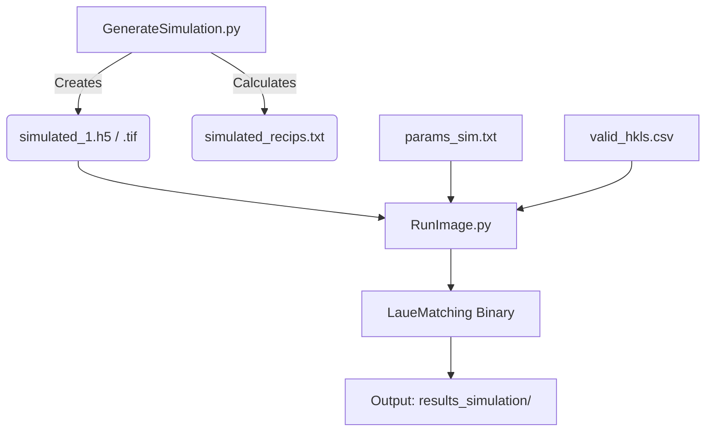

# LaueMatching Simulation Example

This folder contains example scripts and data to demonstrate the LaueMatching workflow:
1. **Simulation**: Generate synthetic diffraction patterns from known orientations.
2. **Indexing**: Process the synthetic data to recover the orientations.

## Workflow



## 1. Generate Simulated Image

Create a synthetic Laue pattern using ground-truth orientations and the experimental geometry defined in `params_sim.txt`.

**Option A: Use 19 random orientations**
```bash
../GenerateSimulation.py \
    -configFile params_sim.txt \
    -orientationFile simulationOrientationMatrices.csv \
    -outputFile simulated_1.h5
```

**Option B: Use 4 specific orientations**
```bash
../GenerateSimulation.py \
    -configFile params_sim.txt \
    -orientationFile fourOrientations.csv \
    -outputFile simulated_1.h5
```

**Outputs:**
- `simulated_1.h5`: The simulated image (uint16 array)
- `simulated_1.h5.tif`: Visual TIFF representation
- `simulated_1.h5_simulated_recips.txt`: Ground truth reciprocal vectors

## 2. Run Indexing (LaueMatching)

Process the simulated image to recover the orientations using the `RunImage.py` wrapper.

```bash
../RunImage.py process \
    -c params_sim.txt \
    -i simulated_1.h5 \
    -n <nCPUs>  # e.g., -n 4
```

> [!NOTE]
> Even when using a GPU build, use multiple CPU cores (`-n <nCPUs>`) because the final Nelder-Mead refinement step runs on the CPU.

**Results:**
Output files will be saved in `results_simulation/` (configured by `ResultDir` in `params_sim.txt`).

## Performance Tips

**Use `/dev/shm` for large orientation lists**

If you are using a very large orientation library (e.g., 100 million points), reading it from disk for every image is slow. Place the files in shared memory (`/dev/shm`) for instant memory mapping:

1. Copy your orientation file to `/dev/shm/100MilOrients.bin`
2. Update `OrientationFile` in `params_sim.txt` to point to `/dev/shm/...`
3. LaueMatching will automatically use `mmap` instead of `fread`.

*(Note: `/dev/shm` is a Linux feature. On macOS, use a standard path, though the OS file cache often helps.)*