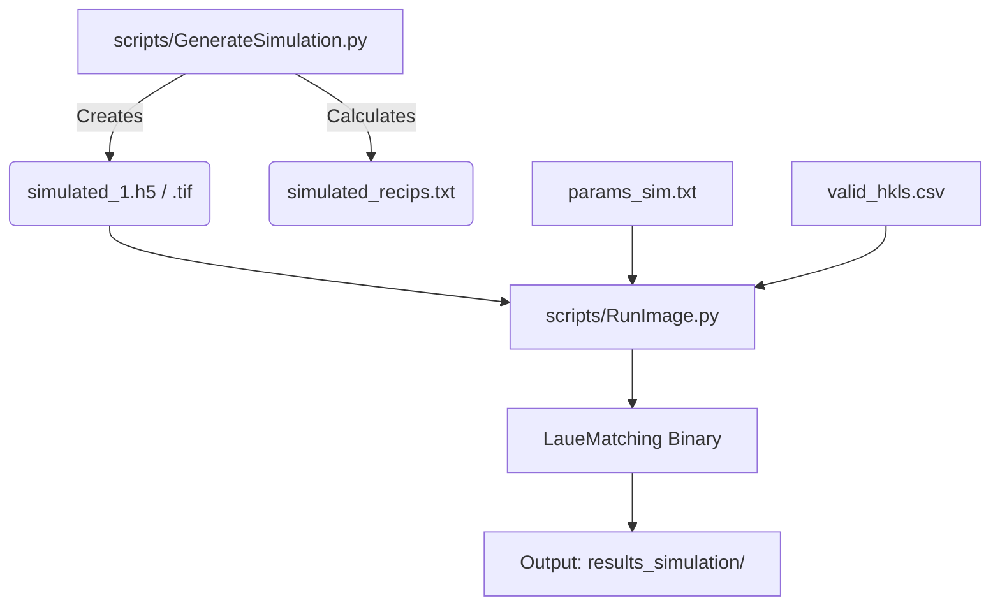

# LaueMatching Simulation Example

This folder contains example data to demonstrate the LaueMatching workflow:
1. **Simulation**: Generate synthetic diffraction patterns from known orientations.
2. **Indexing**: Process the synthetic data to recover the orientations.

## Input Files

| File | Description |
|------|-------------|
| `params_sim.txt` | Parameter file defining crystal, detector, energy range, and processing settings |
| `fourOrientations.csv` | 4 orientation matrices (3×3, row-major, tab-separated). Each row is a flattened 3×3 rotation matrix mapping crystal → lab coordinates |
| `simulationOrientationMatrices.csv` | 19 random orientation matrices (same format as above) |
| `valid_hkls.csv` | Pre-computed list of valid Miller indices (h k l) for the crystal |

## Workflow



## 1. Generate Simulated Image

Create a synthetic Laue pattern using ground-truth orientations and the experimental geometry defined in `params_sim.txt`.

**Option A: Use 19 random orientations**
```bash
python ../scripts/GenerateSimulation.py \
    -configFile params_sim.txt \
    -orientationFile simulationOrientationMatrices.csv \
    -outputFile simulated_1.h5
```

**Option B: Use 4 specific orientations**
```bash
python ../scripts/GenerateSimulation.py \
    -configFile params_sim.txt \
    -orientationFile fourOrientations.csv \
    -outputFile simulated_1.h5
```

**Outputs:**
- `simulated_1.h5`: The simulated image (uint16 array)
- `simulated_1.h5.tif`: Visual TIFF representation
- `simulated_1.h5_simulated_recips.txt`: Ground truth reciprocal vectors

## 2. Run Indexing (LaueMatching)

Process the simulated image to recover the orientations using the `RunImage.py` wrapper.

```bash
python ../scripts/RunImage.py process \
    -c params_sim.txt \
    -i simulated_1.h5 \
    -n <nCPUs>  # e.g., -n 4
```

On GPU:
```bash
python ../scripts/RunImage.py process \
    -c params_sim.txt \
    -i simulated_1.h5 \
    -n <nCPUs> -g  # e.g., -n 4
```

> [!NOTE]
> Even when using a GPU build, use multiple CPU cores (`-n <nCPUs>`) because the final refinement step (BOBYQA or Nelder-Mead) runs on the CPU.

**Results:**
Output files will be saved in `results_simulation/` (configured by `ResultDir` in `params_sim.txt`).

## Parameter Reference (`params_sim.txt`)

| Parameter | Example | Description |
|-----------|---------|-------------|
| **Material** | | |
| `LatticeParameter` | `0.35238 0.35238 0.35238 90 90 90` | a, b, c (nm), α, β, γ (degrees) |
| `SpaceGroup` | `225` | Space group number (1–230) |
| `tol_LatC` | `0.01 0.01 0.01 0 0 0` | Fractional tolerance per lattice param for refinement (0 = fixed) |
| `tol_c_over_a` | `0.02` | c/a ratio tolerance (overrides `tol_LatC` if nonzero) |
| **Detector** | | |
| `P_Array` | `0.028745 0.002788 0.513115` | Detector position [meters] (see paper) |
| `R_Array` | `-1.20131 -1.21399 -1.21881` | Detector rotation vector [radians] (see paper) |
| `PxX` / `PxY` | `0.0002` | Pixel size [meters] |
| `NrPxX` / `NrPxY` | `2048` | Detector dimensions in pixels |
| **Energy** | | |
| `Elo` / `Ehi` | `5` / `30` | Energy range [keV] for Bragg condition filtering |
| **Matching** | | |
| `MinNrSpots` | `7` | Min matching spots to qualify an orientation (1st pass) |
| `MinGoodSpots` | `5` | Min spots after refinement (2nd pass) |
| `MinIntensity` | `50` | Min total intensity from matched pixels |
| `MaxAngle` | `5` | Misorientation threshold [degrees] for merging candidates |
| `MaxNrLaueSpots` | `30` | Max spots per orientation (2nd pass uses 3×) |
| **Files** | | |
| `OrientationFile` | `/dev/shm/100MilOrients.bin` | Binary orientation database. `/dev/shm` enables mmap |
| `ForwardFile` | `/dev/shm/Simulated_FwdSim.bin` | Forward simulation cache |
| `ResultDir` | `results_simulation` | Output directory |
| `HKLFile` | `valid_hkls.csv` | Valid HKL list (auto-generated if missing) |
| `DoFwd` | `0` | Force forward simulation (auto-set to 1 if `ForwardFile` missing) |
| **Optimization** | | |
| `Optimizer` | `NelderMead` | Optimizer choice: omit for BOBYQA (default, faster) or `NelderMead` |
| **Simulation-only** | | |
| `AStar` | `17.83` | Reciprocal lattice constant [nm⁻¹] (only for `GenerateSimulation.py`) |
| `Symmetry` | `F` | Centering symbol: F, I, C, A, R (only for `GenerateSimulation.py`) |
| `OrientationSpacing` | `0.4` | Approximate spacing [degrees] in orientation database |
| `SimulationSmoothingWidth` | `2` | Gaussian peak width for simulated image |

## Performance Tips

**Use `/dev/shm` for large orientation lists**

If you are using a very large orientation library (e.g., 100 million points), reading it from disk for every image is slow. Place the files in shared memory (`/dev/shm`) for instant memory mapping:

1. Copy your orientation file to `/dev/shm/100MilOrients.bin`
2. Update `OrientationFile` in `params_sim.txt` to point to `/dev/shm/...`
3. LaueMatching will automatically use `mmap` instead of `fread`.

*(Note: `/dev/shm` is a Linux feature. On macOS, use a standard path, though the OS file cache often helps.)*

## Streaming Mode (Multiple Images)

If you have many simulated images to process, use the streaming pipeline instead of running `RunImage.py` on each one individually:

```bash
# Generate multiple images first, then:
python ../scripts/laue_orchestrator.py \
    --config params_sim.txt \
    --folder /path/to/simulated_images/ \
    --ncpus 8
```

See [scripts/README.md](../scripts/README.md) for full streaming pipeline documentation.